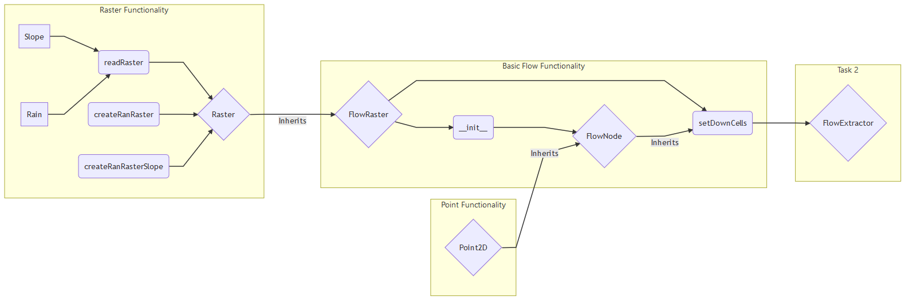

# Final Assessment

##Executing on your device

To test the code on your local device, fork or download the repository.
Python 3 is required for this code.
Through a bash terminal, execute

```
python3 Coursework1.py
```

The code will then automatically create a random generated raster and apply
all analytical functionality to it to solve the tasks specified below.

If your code should work with real DEM and precipitation raster rather than
with randomized ones, the following steps should be applied:

1. Store your DEM and Rainfall Raster in the /data directory in ascii-file format,
like the two example files provided.
2. Edit Coursework1.py and set # in front of lines 95 - 112. In editors like spyder
the shortcut for this operation is ctrl+1.
3. Remove the # from line 115 and specify our file names.
4. Save Coursework1.py and execute as above.   


## Tasks

1. Provide the output of the flow module & a brief explanation

2. Implement a method that calculates flow volume, assuming constant rainfall and plot the resultant data

3. Repeat task 2 but use non-constant rainfall rather than assuming a constant rainfall.

4. Improve the flow algorithm - the water needs to flow into the sea / exit the landscape.

5. Get the code to work with real data:
    a.) Calculate the maximum flow rate in the DEM
    b.) Calculate the location of the maximum flow rate


## Flowdiagram

The followin flow chart should visualize how the different python modules interact with each other.


